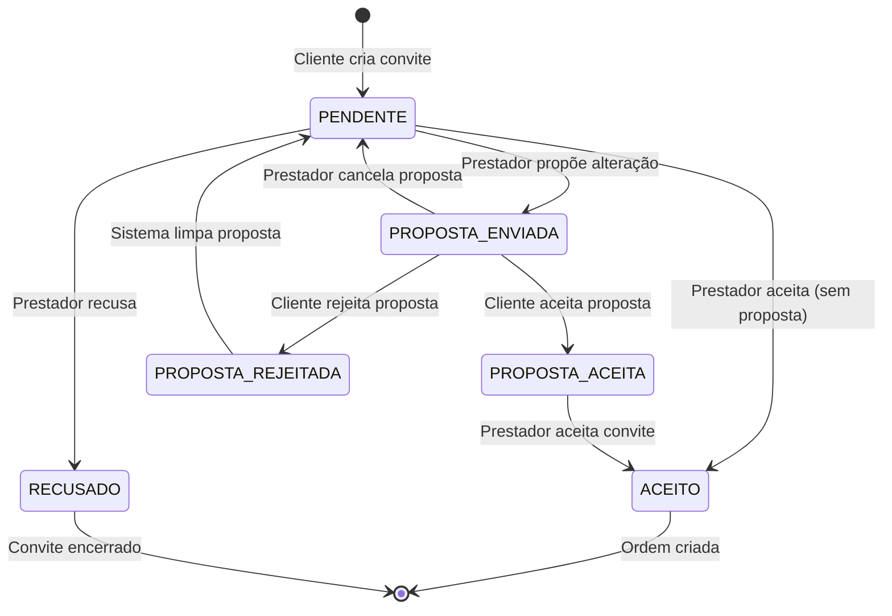

# Design Document

## Overview

Este documento detalha a solução para corrigir os problemas críticos no fluxo de propostas de alteração de convites. A solução foca em três áreas principais:

1. **Gerenciamento de Estado**: Corrigir as transições de estado e limpeza de campos
2. **Interface do Usuário**: Garantir que botões e valores sejam exibidos corretamente
3. **Validações**: Impedir ações inválidas baseadas no estado atual

## Architecture

### Fluxo Corrigido de Estados



### Campos de Proposta no Modelo Invite

```python
class Invite:
    has_active_proposal: bool = False      # Indica se há proposta pendente
    current_proposal_id: int = None        # ID da proposta ativa
    effective_value: Decimal = None        # Valor após proposta aceita
```

**Regras de Gerenciamento:**

| Estado | has_active_proposal | current_proposal_id | effective_value |
|--------|-------------------|-------------------|----------------|
| PENDENTE | False | None | None |
| PROPOSTA_ENVIADA | True | ID da proposta | None |
| PROPOSTA_ACEITA | False | ID da proposta | Valor proposto |
| PROPOSTA_REJEITADA | False | None | None |
| ACEITO | False | ID da proposta (se houver) | Valor efetivo (se houver) |

## Components and Interfaces

### 1. InviteStateManager (Correções)

**Arquivo**: `services/invite_state_manager.py`

**Métodos a Corrigir:**

```python
class InviteStateManager:
    
    @staticmethod
    def transition_to_state(invite, target_state, user_id=None, reason=None):
        """
        Corrigir para limpar campos de proposta corretamente
        """
        # Validar transição
        if not InviteStateManager.can_transition_to(invite, target_state):
            raise ValueError(f"Transição inválida de {invite.status} para {target_state.value}")
        
        # Executar limpeza baseada no estado alvo
        if target_state == InviteState.PENDENTE:
            # Limpar proposta ao retornar para PENDENTE
            invite.clear_active_proposal()
            invite.effective_value = None
            
        elif target_state == InviteState.PROPOSTA_ENVIADA:
            # Manter proposta ativa
            # has_active_proposal e current_proposal_id já foram setados
            pass
            
        elif target_state == InviteState.PROPOSTA_ACEITA:
            # Limpar flag de proposta ativa mas manter referência
            invite.has_active_proposal = False
            # current_proposal_id mantém referência histórica
            # effective_value já foi setado pelo Proposal.accept()
            
        elif target_state == InviteState.PROPOSTA_REJEITADA:
            # Limpar tudo e preparar para retornar a PENDENTE
            invite.clear_active_proposal()
            invite.effective_value = None
            
        # Atualizar status
        invite.status = target_state.value
        
        # Registrar transição
        InviteStateManager._log_transition(invite, target_state, user_id, reason)
        
        # Commit
        db.session.commit()
    
    @staticmethod
    def can_be_accepted(invite):
        """
        Corrigir para bloquear aceitação durante proposta pendente
        """
        # Não pode aceitar se há proposta pendente
        if invite.has_active_proposal:
            return False, "Aguardando resposta do cliente sobre a proposta de alteração"
        
        # Verificar estado
        current_state = InviteState(invite.status)
        
        if current_state == InviteState.PENDENTE:
            return True, "Convite disponível para aceitação"
            
        elif current_state == InviteState.PROPOSTA_ACEITA:
            return True, "Proposta aceita - convite disponível"
            
        else:
            return False, f"Convite não pode ser aceito no estado {current_state.value}"
```

### 2. Proposal Model (Correções)

**Arquivo**: `models.py`

**Métodos a Corrigir:**

```python
class Proposal(db.Model):
    
    def accept(self, client_response_reason=None):
        """
        Corrigir para atualizar campos corretamente
        """
        self.status = 'accepted'
        self.responded_at = datetime.utcnow()
        self.client_response_reason = client_response_reason
        
        # Atualizar convite
        if self.invite:
            # Definir valor efetivo
            self.invite.effective_value = self.proposed_value
            # NÃO limpar current_proposal_id - manter referência
            # Limpar flag de proposta ativa será feito pelo StateManager
    
    def reject(self, client_response_reason=None):
        """
        Corrigir para limpar campos corretamente
        """
        self.status = 'rejected'
        self.responded_at = datetime.utcnow()
        self.client_response_reason = client_response_reason
        
        # Limpar convite - será feito pelo StateManager
        # NÃO fazer aqui para evitar conflito
    
    def cancel(self):
        """
        Corrigir para limpar campos corretamente
        """
        self.status = 'cancelled'
        self.responded_at = datetime.utcnow()
        
        # Limpar convite - será feito pelo StateManager
        # NÃO fazer aqui para evitar conflito
```

### 3. ProposalService (Correções)

**Arquivo**: `services/proposal_service.py`

**Métodos a Corrigir:**

```python
class ProposalService:
    
    @staticmethod
    def approve_proposal(proposal_id, client_id, client_response_reason=None):
        """
        Corrigir sequência de operações
        """
        # ... validações existentes ...
        
        with atomic_financial_operation("approve_proposal"):
            # 1. Aceitar a proposta (atualiza effective_value)
            proposal.accept(sanitized_response_reason)
            db.session.flush()
            
            # 2. Transicionar estado (limpa has_active_proposal)
            proposal.invite.transition_to(
                InviteState.PROPOSTA_ACEITA, 
                client_id,
                f"Proposta aprovada: R$ {proposal.proposed_value}"
            )
            
            # 3. Log de auditoria
            ProposalAuditService.log_proposal_approved(...)
            
            # 4. Notificar prestador
            NotificationService.notify_proposal_response(...)
            
            return {
                'success': True,
                'message': 'Proposta aprovada! O prestador pode aceitar o convite.',
                'effective_value': float(proposal.invite.effective_value),
                ...
            }
    
    @staticmethod
    def reject_proposal(proposal_id, client_id, client_response_reason=None):
        """
        Corrigir sequência de operações
        """
        # ... validações existentes ...
        
        with atomic_financial_operation("reject_proposal"):
            # 1. Rejeitar a proposta
            proposal.reject(sanitized_response_reason)
            db.session.flush()
            
            # 2. Transicionar para PROPOSTA_REJEITADA (limpa campos)
            proposal.invite.transition_to(
                InviteState.PROPOSTA_REJEITADA,
                client_id,
                f"Proposta rejeitada: {client_response_reason or 'Sem motivo'}"
            )
            db.session.flush()
            
            # 3. Transicionar de volta para PENDENTE
            proposal.invite.transition_to(
                InviteState.PENDENTE,
                client_id,
                "Convite retornou ao estado original"
            )
            
            # 4. Log e notificação
            ProposalAuditService.log_proposal_rejected(...)
            NotificationService.notify_proposal_response(...)
            
            return {
                'success': True,
                'message': 'Proposta rejeitada. Convite retornou ao valor original.',
                ...
            }
    
    @staticmethod
    def cancel_proposal(proposal_id, prestador_id):
        """
        Corrigir sequência de operações
        """
        # ... validações existentes ...
        
        with atomic_financial_operation("cancel_proposal"):
            # 1. Cancelar a proposta
            proposal.cancel()
            db.session.flush()
            
            # 2. Transicionar de volta para PENDENTE (limpa campos)
            proposal.invite.transition_to(
                InviteState.PENDENTE,
                prestador_id,
                "Proposta cancelada pelo prestador"
            )
            
            # 3. Log e notificação
            ProposalAuditService.log_proposal_cancelled(...)
            NotificationService.notify_proposal_cancelled(...)
            
            return {
                'success': True,
                'message': 'Proposta cancelada. Convite retornou ao estado original.',
                ...
            }
```

### 4. Interface do Prestador (Correções)

**Arquivo**: `templates/prestador/ver_convite.html`

**Lógica de Exibição do Botão:**

```jinja2
<!-- Botão de Aceitar Convite -->


<button type="submit" 
        class="btn btn-success w-100 mb-2 critical-action"
        disabled
        title="{{ accept_message }}">
    
        <i class="fas fa-clock me-2"></i>Aguardando Cliente
    
        <i class="fas fa-check me-2"></i>Aceitar Convite ({{ invite.effective_value|format_currency }})
    
        <i class="fas fa-check me-2"></i>Aceitar Convite
    
</button>


<small class="text-muted d-block mb-2">
    <i class="fas fa-info-circle me-1"></i>{{ accept_message }}
</small>

```

**Exibição de Valor:**

```jinja2
<!-- Valor do Convite -->
<div class="mb-3">
    <label class="form-label">Valor do Serviço:</label>
    
    
        <!-- Mostrar valor efetivo após proposta aceita -->
        <div class="h4 text-success">{{ invite.effective_value|format_currency }}</div>
        <small class="text-muted">
            Valor original: <s>{{ invite.original_value|format_currency }}</s>
        </small>
    
        <!-- Mostrar valor proposto pendente -->
        
        <div class="h4 text-warning">{{ active_proposal.proposed_value|format_currency }}</div>
        <small class="text-muted">
            Proposta enviada - aguardando aprovação do cliente
        </small>
    
        <!-- Mostrar valor original -->
        <div class="h4 text-primary">{{ invite.original_value|format_currency }}</div>
    
</div>
```

### 5. Interface do Cliente (Correções)

**Arquivo**: `templates/cliente/ver_convite.html`

**Exibição de Valor:**

```jinja2
<!-- Valor do Convite -->
<div class="mb-3">
    <label class="form-label">Valor do Serviço:</label>
    
    
        <!-- Mostrar valor efetivo após proposta aceita -->
        <div class="h4 text-success">{{ invite.effective_value|format_currency }}</div>
        <small class="text-muted">
            Valor original: {{ invite.original_value|format_currency }}
            
                <span class="text-danger">(+{{ (invite.effective_value - invite.original_value)|format_currency }})</span>
            
                <span class="text-success">({{ (invite.effective_value - invite.original_value)|format_currency }})</span>
            
        </small>
    
        <!-- Mostrar valor original -->
        <div class="h4 text-primary">{{ invite.original_value|format_currency }}</div>
    
</div>
```

**Card de Proposta Pendente:**

```jinja2

    
    
    <div class="card border-warning mb-4">
        <div class="card-header bg-warning text-dark">
            <h5 class="mb-0">
                <i class="fas fa-exclamation-triangle me-2"></i>
                Proposta de Alteração Pendente
            </h5>
        </div>
        <div class="card-body">
            <!-- Comparação de valores -->
            <div class="row mb-3">
                <div class="col-md-6">
                    <strong>Valor Original:</strong>
                    <div class="h5 text-muted">{{ active_proposal.original_value|format_currency }}</div>
                </div>
                <div class="col-md-6">
                    <strong>Valor Proposto:</strong>
                    <div class="h5 text-dangertext-success">
                        {{ active_proposal.proposed_value|format_currency }}
                    </div>
                </div>
            </div>
            
            <!-- Justificativa -->
            <div class="mb-3">
                <strong>Justificativa:</strong>
                <p class="text-muted">{{ active_proposal.justification or 'Nenhuma justificativa fornecida' }}</p>
            </div>
            
            <!-- Ações -->
            <div class="row">
                <div class="col-md-6">
                    <button type="button" 
                            class="btn btn-success w-100" 
                            id="btn-aceitar-proposta"
                            data-proposal-id="{{ active_proposal.id }}">
                        <i class="fas fa-check me-2"></i>Aceitar Proposta
                    </button>
                </div>
                <div class="col-md-6">
                    <button type="button" 
                            class="btn btn-danger w-100"
                            data-bs-toggle="modal" 
                            data-bs-target="#rejectProposalModal">
                        <i class="fas fa-times me-2"></i>Rejeitar Proposta
                    </button>
                </div>
            </div>
        </div>
    </div>
    

```

### 6. JavaScript (Correções)

**Arquivo**: `static/js/proposal-interactions.js`

**Atualização após Rejeição:**

```javascript
async handleRejectProposal(e) {
    e.preventDefault();
    
    const form = e.target;
    const submitBtn = form.querySelector('button[type="submit"]');
    
    this.setButtonLoading(submitBtn, true);
    
    try {
        const formData = new FormData(form);
        const response = await fetch(form.action, {
            method: 'POST',
            body: formData
        });
        
        const data = await response.json();
        
        if (data.success) {
            this.showNotification('✅ Proposta rejeitada! Convite retornou ao valor original.', 'success');
            
            // Recarregar para mostrar estado atualizado
            setTimeout(() => location.reload(), 1500);
        } else {
            throw new Error(data.message || 'Erro ao rejeitar proposta');
        }
    } catch (error) {
        console.error('Erro ao rejeitar proposta:', error);
        this.showNotification('❌ ' + error.message, 'error');
        this.setButtonLoading(submitBtn, false);
    }
}
```

## Data Models

### Mudanças no Modelo Invite

Nenhuma mudança estrutural necessária. Apenas correção na lógica de gerenciamento dos campos existentes:

- `has_active_proposal`: Deve ser `True` apenas quando há proposta PENDENTE
- `current_proposal_id`: Mantém referência histórica mesmo após resposta
- `effective_value`: Deve ser setado apenas quando proposta é ACEITA

### Mudanças no Modelo Proposal

Nenhuma mudança estrutural necessária. Apenas correção nos métodos `accept()`, `reject()` e `cancel()`.

## Error Handling

### 1. Tentativa de Aceitar Convite com Proposta Pendente

**Cenário**: Prestador tenta aceitar convite via API enquanto proposta está pendente

**Solução**:
```python
# Em invite_service.py
def accept_invite(invite_id, prestador_id):
    invite = Invite.query.get(invite_id)
    
    # Validar se pode aceitar
    can_accept, message = invite.can_be_accepted()
    if not can_accept:
        raise ValueError(message)
    
    # ... continuar com aceitação
```

### 2. Estado Inconsistente Após Erro

**Cenário**: Erro durante transição de estado deixa dados inconsistentes

**Solução**: Usar transações atômicas em todas as operações
```python
with atomic_financial_operation("operation_name"):
    # Todas as mudanças aqui
    # Rollback automático em caso de erro
```

### 3. Proposta Órfã

**Cenário**: Proposta fica com status pendente mas convite não tem referência

**Solução**: Job de limpeza periódico
```python
def cleanup_orphan_proposals():
    """Limpar propostas órfãs"""
    orphan_proposals = Proposal.query.filter(
        Proposal.status == 'pending',
        ~Proposal.invite.has_(has_active_proposal=True)
    ).all()
    
    for proposal in orphan_proposals:
        proposal.status = 'cancelled'
        proposal.responded_at = datetime.utcnow()
    
    db.session.commit()
```

## Testing Strategy

### 1. Testes de Transição de Estado

```python
def test_proposal_rejection_clears_fields():
    """Testar que rejeição limpa campos corretamente"""
    # Criar convite e proposta
    invite = create_test_invite()
    proposal = create_test_proposal(invite)
    
    # Verificar que campos foram setados
    assert invite.has_active_proposal == True
    assert invite.current_proposal_id == proposal.id
    assert invite.effective_value is None
    
    # Rejeitar proposta
    ProposalService.reject_proposal(proposal.id, invite.client_id)
    
    # Verificar que campos foram limpos
    assert invite.has_active_proposal == False
    assert invite.current_proposal_id is None
    assert invite.effective_value is None
    assert invite.status == 'pendente'
```

### 2. Testes de Interface

```python
def test_accept_button_disabled_during_proposal():
    """Testar que botão fica desabilitado durante proposta"""
    # Criar convite com proposta pendente
    invite = create_test_invite_with_proposal()
    
    # Verificar que não pode aceitar
    can_accept, message = invite.can_be_accepted()
    assert can_accept == False
    assert "Aguardando" in message
```

### 3. Testes de Valor Efetivo

```python
def test_effective_value_after_approval():
    """Testar que valor efetivo é setado após aprovação"""
    invite = create_test_invite()
    proposal = create_test_proposal(invite, proposed_value=Decimal('150.00'))
    
    # Aprovar proposta
    ProposalService.approve_proposal(proposal.id, invite.client_id)
    
    # Verificar valor efetivo
    assert invite.effective_value == Decimal('150.00')
    assert invite.has_active_proposal == False
    assert invite.status == 'proposta_aceita'
```

## Implementation Notes

### Ordem de Implementação

1. **Corrigir InviteStateManager** - Base para todas as outras correções
2. **Corrigir métodos do Proposal** - Remover limpeza duplicada
3. **Corrigir ProposalService** - Sequência correta de operações
4. **Atualizar templates** - Exibição correta de valores e botões
5. **Atualizar JavaScript** - Feedback correto após ações
6. **Testes** - Validar todas as correções

### Pontos de Atenção

1. **Não limpar campos em múltiplos lugares** - Apenas no StateManager
2. **Manter referência histórica** - current_proposal_id não deve ser limpo após resposta
3. **Validar antes de aceitar** - Sempre usar `can_be_accepted()`
4. **Usar transações atômicas** - Garantir consistência
5. **Testar todos os fluxos** - Aprovação, rejeição, cancelamento

## Security Considerations

Todas as validações de segurança existentes devem ser mantidas:
- Autorização (apenas dono pode aprovar/rejeitar)
- Sanitização de inputs
- Rate limiting
- Validação de valores

## Performance Considerations

As correções não devem impactar performance:
- Mesmas queries ao banco
- Mesma estrutura de dados
- Apenas correção de lógica
