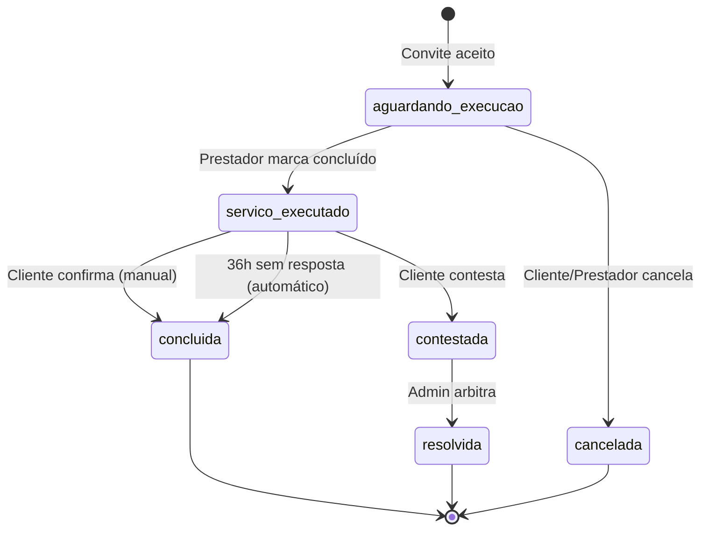

# Design Document

## Overview

Este documento descreve o design técnico do sistema completo de gestão de ordens de serviço. O sistema gerencia todo o ciclo de vida de uma ordem desde sua criação (conversão de convite aceito) até a conclusão, incluindo fluxos alternativos de cancelamento e contestação. O design inclui um dashboard centralizado, sistema de confirmação automática de 36 horas, gestão de multas e arbitragem de disputas.

## Architecture

### High-Level Architecture

```
┌─────────────────────────────────────────────────────────────┐
│                     Presentation Layer                       │
│  ┌──────────────┐  ┌──────────────┐  ┌──────────────┐      │
│  │   Cliente    │  │  Prestador   │  │    Admin     │      │
│  │  Dashboard   │  │  Dashboard   │  │  Dashboard   │      │
│  └──────────────┘  └──────────────┘  └──────────────┘      │
└─────────────────────────────────────────────────────────────┘
                            │
┌─────────────────────────────────────────────────────────────┐
│                      Routes Layer                            │
│  ┌──────────────┐  ┌──────────────┐  ┌──────────────┐      │
│  │ order_routes │  │cliente_routes│  │ admin_routes │      │
│  └──────────────┘  └──────────────┘  └──────────────┘      │
└─────────────────────────────────────────────────────────────┘
                            │
┌─────────────────────────────────────────────────────────────┐
│                     Service Layer                            │
│  ┌──────────────────────────────────────────────────┐       │
│  │      OrderManagementService (Core Logic)         │       │
│  └──────────────────────────────────────────────────┘       │
│  ┌──────────────┐  ┌──────────────┐  ┌──────────────┐      │
│  │WalletService │  │Notification  │  │ConfigService │      │
│  │              │  │Service       │  │              │      │
│  └──────────────┘  └──────────────┘  └──────────────┘      │
└─────────────────────────────────────────────────────────────┘
                            │
┌─────────────────────────────────────────────────────────────┐
│                      Data Layer                              │
│  ┌──────────────┐  ┌──────────────┐  ┌──────────────┐      │
│  │    Order     │  │    Wallet    │  │SystemConfig  │      │
│  │    Model     │  │    Model     │  │    Model     │      │
│  └──────────────┘  └──────────────┘  └──────────────┘      │
└─────────────────────────────────────────────────────────────┘
                            │
┌─────────────────────────────────────────────────────────────┐
│                    Background Jobs                           │
│  ┌──────────────────────────────────────────────────┐       │
│  │  AutoConfirmOrdersJob (Runs every hour)         │       │
│  │  - Finds expired orders                          │       │
│  │  - Processes automatic confirmations             │       │
│  │  - Sends notifications                           │       │
│  └──────────────────────────────────────────────────┘       │
└─────────────────────────────────────────────────────────────┘
```

### State Machine Diagram



## Components and Interfaces

### 1. OrderManagementService

Serviço central que gerencia toda a lógica de negócio das ordens.

#### Methods

```python
class OrderManagementService:
    """Serviço para gerenciamento completo de ordens"""
    
    @staticmethod
    def create_order_from_invite(invite_id: int, provider_id: int) -> Tuple[Order, str]:
        """
        Cria uma ordem a partir de um convite aceito
        
        Args:
            invite_id: ID do convite
            provider_id: ID do prestador que aceitou
            
        Returns:
            Tuple[Order, str]: Ordem criada e mensagem de sucesso/erro
            
        Process:
            1. Validar convite (existe, não expirado, não convertido)
            2. Obter taxas atuais do SystemConfig
            3. Calcular valores (serviço, taxas, bloqueios)
            4. Bloquear valores nas carteiras (cliente e prestador)
            5. Criar ordem com status aguardando_execucao
            6. Atualizar convite (status=convertido, order_id)
            7. Enviar notificações
            8. Commit transação atômica
        """
        pass
    
    @staticmethod
    def mark_service_completed(order_id: int, provider_id: int) -> Tuple[bool, str]:
        """
        Prestador marca o serviço como concluído
        
        Args:
            order_id: ID da ordem
            provider_id: ID do prestador (validação)
            
        Returns:
            Tuple[bool, str]: Sucesso e mensagem
            
        Process:
            1. Validar ordem (existe, pertence ao prestador, status correto)
            2. Atualizar status para servico_executado
            3. Registrar completed_at = now
            4. Calcular confirmation_deadline = now + 36h
            5. Calcular dispute_deadline = now + 36h
            6. Enviar notificação ao cliente (URGENTE: 36h)
            7. Commit transação
        """
        pass
    
    @staticmethod
    def confirm_service(order_id: int, client_id: int) -> Tuple[bool, str]:
        """
        Cliente confirma manualmente o serviço
        
        Args:
            order_id: ID da ordem
            client_id: ID do cliente (validação)
            
        Returns:
            Tuple[bool, str]: Sucesso e mensagem
            
        Process:
            1. Validar ordem (existe, pertence ao cliente, status=servico_executado)
            2. Validar prazo (dentro de 36h)
            3. Processar pagamentos (ver _process_order_payments)
            4. Atualizar status para concluida
            5. Registrar confirmed_at = now
            6. Enviar notificações
            7. Commit transação atômica
        """
        pass
    
    @staticmethod
    def auto_confirm_expired_orders() -> Dict[str, Any]:
        """
        Job automático: confirma ordens que ultrapassaram 36h
        
        Returns:
            Dict com estatísticas: {
                'processed': int,
                'confirmed': int,
                'errors': List[str]
            }
            
        Process:
            1. Buscar ordens com status=servico_executado
            2. Filtrar onde confirmation_deadline <= now
            3. Para cada ordem:
                a. Processar pagamentos
                b. Atualizar status para concluida
                c. Registrar confirmed_at e auto_confirmed=True
                d. Enviar notificações
            4. Registrar logs detalhados
        """
        pass
    
    @staticmethod
    def cancel_order(order_id: int, user_id: int, reason: str) -> Tuple[bool, str]:
        """
        Cancela uma ordem com aplicação de multa
        
        Args:
            order_id: ID da ordem
            user_id: ID de quem está cancelando
            reason: Motivo do cancelamento
            
        Returns:
            Tuple[bool, str]: Sucesso e mensagem
            
        Process:
            1. Validar ordem (existe, status=aguardando_execucao)
            2. Validar usuário (é cliente ou prestador da ordem)
            3. Obter taxa de cancelamento do SystemConfig
            4. Calcular multa (% do valor do serviço)
            5. Processar pagamentos de cancelamento:
                - 50% multa para plataforma
                - 50% multa para parte prejudicada
                - Devolver valor do serviço (menos multa) para quem cancelou
                - Devolver taxas de contestação para ambos
            6. Atualizar ordem (status, cancelled_by, cancelled_at, reason)
            7. Enviar notificações
            8. Commit transação atômica
        """
        pass
    
    @staticmethod
    def open_dispute(order_id: int, client_id: int, reason: str, 
                     evidence_files: List[FileStorage]) -> Tuple[bool, str]:
        """
        Cliente abre uma contestação
        
        Args:
            order_id: ID da ordem
            client_id: ID do cliente
            reason: Motivo da contestação (min 20 chars)
            evidence_files: Lista de arquivos de prova
            
        Returns:
            Tuple[bool, str]: Sucesso e mensagem
            
        Process:
            1. Validar ordem (existe, pertence ao cliente, status=servico_executado)
            2. Validar prazo (dentro de 36h)
            3. Validar motivo (mínimo 20 caracteres)
            4. Upload de arquivos de prova (storage seguro)
            5. Atualizar ordem:
                - status = contestada
                - dispute_opened_by = client_id
                - dispute_opened_at = now
                - dispute_client_statement = reason
                - dispute_evidence = [URLs dos arquivos]
            6. Enviar notificações (admin e prestador)
            7. Commit transação
        """
        pass
    
    @staticmethod
    def resolve_dispute(order_id: int, admin_id: int, winner: str, 
                       admin_notes: str) -> Tuple[bool, str]:
        """
        Admin arbitra uma contestação
        
        Args:
            order_id: ID da ordem
            admin_id: ID do admin
            winner: 'client' ou 'provider'
            admin_notes: Notas da decisão
            
        Returns:
            Tuple[bool, str]: Sucesso e mensagem
            
        Process:
            1. Validar ordem (existe, status=contestada)
            2. Validar winner ('client' ou 'provider')
            3. Processar pagamentos conforme vencedor:
                - Se cliente: devolver valor, cobrar taxa contestação
                - Se prestador: pagar serviço, devolver garantia
            4. Atualizar ordem:
                - status = resolvida
                - dispute_winner = winner
                - dispute_resolved_at = now
                - dispute_resolved_by = admin_id
                - dispute_admin_notes = admin_notes
            5. Enviar notificações (ambas as partes)
            6. Commit transação atômica
        """
        pass
    
    @staticmethod
    def get_orders_by_user(user_id: int, role: str, 
                          status_filter: str = None) -> List[Order]:
        """
        Lista ordens de um usuário com filtros
        
        Args:
            user_id: ID do usuário
            role: 'cliente' ou 'prestador'
            status_filter: Filtro opcional de status
            
        Returns:
            List[Order]: Lista de ordens ordenadas por data
        """
        pass
    
    @staticmethod
    def get_order_statistics(user_id: int, role: str) -> Dict[str, int]:
        """
        Retorna estatísticas de ordens para o dashboard
        
        Args:
            user_id: ID do usuário
            role: 'cliente' ou 'prestador'
            
        Returns:
            Dict com contadores: {
                'total': int,
                'aguardando': int,
                'para_confirmar': int,  # cliente
                'aguardando_cliente': int,  # prestador
                'concluidas': int,
                'canceladas': int,
                'contestadas': int
            }
        """
        pass
    
    @staticmethod
    def _process_order_payments(order: Order) -> bool:
        """
        Processa pagamentos de uma ordem concluída
        
        Process:
            1. Calcular valores:
                - valor_liquido_prestador = valor - taxa_plataforma
                - taxa_plataforma = valor * platform_fee_percentage
            2. Transferir valor_liquido_prestador para prestador
            3. Transferir taxa_plataforma para admin
            4. Devolver taxa_contestação para cliente
            5. Devolver taxa_contestação para prestador
            6. Registrar todas as transações
            7. Validar saldos finais
        """
        pass
    
    @staticmethod
    def _process_cancellation_payments(order: Order, cancelled_by_id: int) -> bool:
        """
        Processa pagamentos de cancelamento
        
        Process:
            1. Calcular multa = valor * cancellation_fee_percentage
            2. Identificar parte prejudicada
            3. Transferir 50% multa para plataforma
            4. Transferir 50% multa para parte prejudicada
            5. Devolver valor - multa para quem cancelou
            6. Devolver taxas de contestação para ambos
            7. Registrar transações
        """
        pass
```

### 2. ConfigService

Gerencia configurações dinâmicas do sistema.

```python
class ConfigService:
    """Serviço para gerenciamento de configurações"""
    
    @staticmethod
    def get_platform_fee_percentage() -> Decimal:
        """Retorna taxa da plataforma (padrão: 5.0%)"""
        pass
    
    @staticmethod
    def get_contestation_fee() -> Decimal:
        """Retorna taxa de contestação (padrão: 10.00)"""
        pass
    
    @staticmethod
    def get_cancellation_fee_percentage() -> Decimal:
        """Retorna taxa de cancelamento (padrão: 10.0%)"""
        pass
    
    @staticmethod
    def set_platform_fee_percentage(value: Decimal, admin_id: int) -> bool:
        """
        Atualiza taxa da plataforma
        
        Process:
            1. Validar valor (0-100%)
            2. Atualizar SystemConfig
            3. Registrar log de alteração
            4. Retornar sucesso
        """
        pass
    
    @staticmethod
    def set_contestation_fee(value: Decimal, admin_id: int) -> bool:
        """Atualiza taxa de contestação"""
        pass
    
    @staticmethod
    def set_cancellation_fee_percentage(value: Decimal, admin_id: int) -> bool:
        """Atualiza taxa de cancelamento"""
        pass
    
    @staticmethod
    def get_all_fees() -> Dict[str, Decimal]:
        """
        Retorna todas as taxas atuais
        
        Returns:
            {
                'platform_fee_percentage': Decimal,
                'contestation_fee': Decimal,
                'cancellation_fee_percentage': Decimal
            }
        """
        pass
```

### 3. Routes

#### order_routes.py

```python
# GET /ordens
# Lista ordens do usuário (cliente ou prestador)
# Query params: status (opcional)
# Response: Renderiza dashboard com lista de ordens

# GET /ordens/<id>
# Exibe detalhes de uma ordem específica
# Validação: usuário deve ser cliente ou prestador da ordem
# Response: Renderiza página de detalhes

# POST /ordens/<id>/marcar-concluido
# Prestador marca serviço como concluído
# Validação: usuário deve ser o prestador
# Response: Redirect para detalhes com mensagem

# POST /ordens/<id>/confirmar
# Cliente confirma serviço manualmente
# Validação: usuário deve ser o cliente
# Response: Redirect para detalhes com mensagem

# GET /ordens/<id>/contestar
# Exibe formulário de contestação
# Validação: usuário deve ser o cliente

# POST /ordens/<id>/contestar
# Cliente submete contestação
# Validação: usuário deve ser o cliente, dentro de 36h
# Files: evidence_files (múltiplos)
# Response: Redirect para detalhes

# POST /ordens/<id>/cancelar
# Cancela ordem com multa
# Validação: usuário deve ser cliente ou prestador
# Body: reason (motivo)
# Response: Redirect para dashboard

# GET /ordens/<id>/status (API)
# Retorna status atual da ordem em JSON
# Response: {status, hours_remaining, can_confirm, can_dispute}

# GET /ordens/estatisticas (API)
# Retorna estatísticas para o dashboard
# Response: {total, aguardando, para_confirmar, ...}
```

#### admin_routes.py

```python
# GET /admin/ordens
# Lista todas as ordens (com filtros)
# Query params: status, user_id, date_range

# GET /admin/ordens/<id>
# Detalhes completos da ordem (visão admin)

# GET /admin/contestacoes
# Lista contestações pendentes

# GET /admin/contestacoes/<order_id>
# Detalhes da contestação com provas

# POST /admin/contestacoes/<order_id>/resolver
# Admin arbitra contestação
# Body: winner ('client' ou 'provider'), admin_notes

# GET /admin/configuracoes/taxas
# Exibe formulário de configuração de taxas

# POST /admin/configuracoes/taxas
# Atualiza taxas do sistema
# Body: platform_fee, contestation_fee, cancellation_fee
```

### 4. Background Job

#### auto_confirm_orders.py

```python
#!/usr/bin/env python3.11
"""
Job automático para confirmação de ordens após 36h

Execução: A cada hora via cron
Cron: 0 * * * * cd /path && python3.11 jobs/auto_confirm_orders.py
"""

def main():
    """
    Process:
        1. Inicializar app context
        2. Chamar OrderManagementService.auto_confirm_expired_orders()
        3. Registrar logs detalhados
        4. Enviar alerta se houver erros
    """
    pass

if __name__ == '__main__':
    main()
```

## Data Models

### Order Model (Extensões)

```python
class Order(db.Model):
    # ... campos existentes ...
    
    # Novos campos para configurações
    platform_fee_percentage_at_creation = db.Column(db.Numeric(5, 2))
    contestation_fee_at_creation = db.Column(db.Numeric(10, 2))
    cancellation_fee_percentage_at_creation = db.Column(db.Numeric(5, 2))
    
    # Campo para confirmação automática
    auto_confirmed = db.Column(db.Boolean, default=False)
    
    # Campos para upload de provas
    dispute_evidence_urls = db.Column(db.JSON)  # Array de URLs
```

### SystemConfig Model (Chaves Necessárias)

```python
# Chaves de configuração:
# - 'platform_fee_percentage': Taxa da plataforma (%)
# - 'contestation_fee': Taxa de contestação (valor fixo)
# - 'cancellation_fee_percentage': Taxa de cancelamento (%)
# - 'confirmation_deadline_hours': Prazo para confirmação (fixo: 36)

# Exemplo de registro:
SystemConfig(
    key='platform_fee_percentage',
    value='5.0',
    description='Percentual cobrado pela plataforma sobre o valor do serviço',
    category='taxas'
)
```

## Error Handling

### Validation Errors

```python
class OrderValidationError(Exception):
    """Erro de validação de ordem"""
    pass

# Casos de erro:
# - Ordem não encontrada
# - Usuário não autorizado
# - Status inválido para ação
# - Prazo expirado
# - Saldo insuficiente
# - Arquivo de prova inválido
```

### Transaction Rollback

Todas as operações financeiras usam transações atômicas:

```python
try:
    # Operações
    db.session.commit()
except Exception as e:
    db.session.rollback()
    logger.error(f"Erro: {e}")
    raise
```

## Testing Strategy

### Unit Tests

```python
# test_order_management_service.py
def test_mark_service_completed():
    """Testa marcação de serviço como concluído"""
    # Arrange: criar ordem
    # Act: marcar como concluído
    # Assert: status, datas, notificações

def test_auto_confirm_after_36h():
    """Testa confirmação automática"""
    # Arrange: criar ordem expirada
    # Act: executar job
    # Assert: status, pagamentos

def test_cancel_with_penalty():
    """Testa cancelamento com multa"""
    # Arrange: criar ordem
    # Act: cancelar
    # Assert: multa, distribuição, saldos

def test_dispute_resolution_client_wins():
    """Testa arbitragem a favor do cliente"""
    # Arrange: criar contestação
    # Act: admin decide por cliente
    # Assert: pagamentos, status

def test_config_service_update_fees():
    """Testa atualização de taxas"""
    # Arrange: taxas antigas
    # Act: atualizar
    # Assert: novas taxas, ordens antigas mantêm taxas originais
```

### Integration Tests

```python
# test_order_flow_integration.py
def test_complete_order_flow():
    """Testa fluxo completo: criação -> conclusão -> confirmação"""
    pass

def test_cancellation_flow():
    """Testa fluxo de cancelamento com multas"""
    pass

def test_dispute_flow():
    """Testa fluxo de contestação e arbitragem"""
    pass

def test_auto_confirmation_job():
    """Testa job de confirmação automática end-to-end"""
    pass
```

## Security Considerations

### Authorization

- Validar propriedade da ordem antes de qualquer ação
- Apenas prestador pode marcar como concluído
- Apenas cliente pode confirmar/contestar
- Apenas admin pode arbitrar

### File Upload Security

```python
# Validações de upload:
# - Tipos permitidos: jpg, png, pdf, mp4
# - Tamanho máximo: 10MB por arquivo
# - Máximo 5 arquivos por contestação
# - Sanitização de nomes de arquivo
# - Storage em diretório seguro fora de webroot
# - URLs assinadas para acesso
```

### Financial Integrity

- Todas as transferências em transações atômicas
- Validação de saldos antes de transferir
- Logs detalhados de todas as operações
- IDs únicos para rastreabilidade
- Checksums de valores

## Performance Considerations

### Database Indexes

```sql
CREATE INDEX idx_orders_status ON orders(status);
CREATE INDEX idx_orders_confirmation_deadline ON orders(confirmation_deadline);
CREATE INDEX idx_orders_client_id ON orders(client_id);
CREATE INDEX idx_orders_provider_id ON orders(provider_id);
CREATE INDEX idx_orders_created_at ON orders(created_at DESC);
```

### Caching

- Cache de configurações do sistema (5 minutos)
- Cache de estatísticas do dashboard (30 segundos)

### Query Optimization

```python
# Eager loading de relacionamentos
orders = Order.query.options(
    db.joinedload(Order.client),
    db.joinedload(Order.provider)
).filter_by(client_id=user_id).all()
```

## UI/UX Design

### Dashboard Layout

```
┌─────────────────────────────────────────────────────────┐
│  Minhas Ordens                                          │
├─────────────────────────────────────────────────────────┤
│  ┌─────┐ ┌─────┐ ┌─────┐ ┌─────┐ ┌─────┐ ┌─────┐      │
│  │Total│ │Aguar│ │P/Conf│ │Concl│ │Canc │ │Conte│      │
│  │  15 │ │  3  │ │  2  │ │  8  │ │  1  │ │  1  │      │
│  └─────┘ └─────┘ └─────┘ └─────┘ └─────┘ └─────┘      │
├─────────────────────────────────────────────────────────┤
│  Filtros: [Todas] [Aguardando] [Para Confirmar] ...    │
├─────────────────────────────────────────────────────────┤
│  ┌───────────────────────────────────────────────────┐  │
│  │ 🔧 Instalação Elétrica                           │  │
│  │ Prestador: João Silva                            │  │
│  │ Valor: R$ 500,00                                 │  │
│  │ Status: ⏳ Serviço Executado                     │  │
│  │ ⚠️ Faltam 8 horas para confirmação automática   │  │
│  │ [Confirmar] [Contestar]                          │  │
│  └───────────────────────────────────────────────────┘  │
│  ┌───────────────────────────────────────────────────┐  │
│  │ 🔧 Conserto de Encanamento                       │  │
│  │ ...                                              │  │
│  └───────────────────────────────────────────────────┘  │
└─────────────────────────────────────────────────────────┘
```

### Status Colors

- 🟡 Amarelo: aguardando_execucao
- 🔵 Azul: servico_executado
- 🟢 Verde: concluida
- 🔴 Vermelho: cancelada
- 🟠 Laranja: contestada, resolvida

### Responsive Breakpoints

- Mobile: < 768px (cards empilhados)
- Tablet: 768px - 1024px (2 colunas)
- Desktop: > 1024px (3 colunas)

## Deployment Considerations

### Environment Variables

```bash
# Configurações de upload
UPLOAD_FOLDER=/var/uploads/evidence
MAX_UPLOAD_SIZE=10485760  # 10MB

# Configurações de job
AUTO_CONFIRM_JOB_ENABLED=true
AUTO_CONFIRM_LOG_PATH=/var/log/auto_confirm.log
```

### Cron Setup

```bash
# Adicionar ao crontab
0 * * * * cd /home/ubuntu/projeto && /usr/bin/python3.11 jobs/auto_confirm_orders.py >> logs/cron_auto_confirm.log 2>&1
```

### Monitoring

- Alertas se job falhar por 2 horas consecutivas
- Métricas: taxa de confirmação automática, tempo médio de resposta
- Logs: todas as operações financeiras e mudanças de status

## Migration Plan

### Database Migrations

```python
# Migration: add_order_config_fields
def upgrade():
    op.add_column('orders', sa.Column('platform_fee_percentage_at_creation', sa.Numeric(5, 2)))
    op.add_column('orders', sa.Column('contestation_fee_at_creation', sa.Numeric(10, 2)))
    op.add_column('orders', sa.Column('cancellation_fee_percentage_at_creation', sa.Numeric(5, 2)))
    op.add_column('orders', sa.Column('auto_confirmed', sa.Boolean(), default=False))
    op.add_column('orders', sa.Column('dispute_evidence_urls', sa.JSON()))
```

### Data Seeding

```python
# Seed configurações padrão
configs = [
    SystemConfig(key='platform_fee_percentage', value='5.0', category='taxas'),
    SystemConfig(key='contestation_fee', value='10.00', category='taxas'),
    SystemConfig(key='cancellation_fee_percentage', value='10.0', category='taxas'),
    SystemConfig(key='confirmation_deadline_hours', value='36', category='prazos'),
]
```
