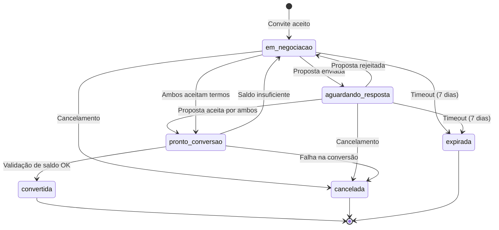

# Design Document

## Overview

O sistema de pré-ordem resolve um conflito arquitetural crítico no fluxo atual: quando um convite é aceito, uma ordem é criada imediatamente, mas a aba "Convites" ainda permite modificações, criando inconsistência entre duas abas controlando o mesmo processo.

A solução introduz uma **pré-ordem** como estágio intermediário de negociação entre a aceitação do convite e a criação da ordem definitiva. Este design:

- Mantém convites como porta de entrada simples (aceitar/rejeitar)
- Centraliza toda negociação na pré-ordem
- Bloqueia valores apenas quando ambas as partes concordam
- Elimina conflitos entre abas de convites e ordens

## Architecture

### Camadas do Sistema

```
┌─────────────────────────────────────────────────────────────┐
│                    Presentation Layer                        │
│  - Templates (pre_ordem_detalhes.html, dashboard.html)      │
│  - JavaScript (pre-ordem-interactions.js)                    │
└─────────────────────────────────────────────────────────────┘
                            ↓
┌─────────────────────────────────────────────────────────────┐
│                      Routes Layer                            │
│  - /pre-ordem/<id>                                          │
│  - /pre-ordem/<id>/propor-alteracao                        │
│  - /pre-ordem/<id>/aceitar-termos                          │
│  - /pre-ordem/<id>/cancelar                                │
└─────────────────────────────────────────────────────────────┘
                            ↓
┌─────────────────────────────────────────────────────────────┐
│                     Service Layer                            │
│  - PreOrderService (lógica de negócio)                      │
│  - PreOrderStateManager (máquina de estados)                │
│  - PreOrderProposalService (gestão de propostas)            │
│  - PreOrderConversionService (conversão para ordem)         │
└─────────────────────────────────────────────────────────────┘
                            ↓
┌─────────────────────────────────────────────────────────────┐
│                      Data Layer                              │
│  - PreOrder (modelo principal)                              │
│  - PreOrderProposal (propostas de alteração)                │
│  - PreOrderHistory (histórico de eventos)                   │
└─────────────────────────────────────────────────────────────┘
```

### Fluxo de Estados da Pré-Ordem



### Integração com Sistema Existente

```
Convite (existente)
    ↓ aceitar
PreOrdem (novo)
    ↓ aceitação mútua + validação
Ordem (existente)
    ↓ escrow
WalletService (existente)
```

## Components and Interfaces

### 1. PreOrder Model

```python
class PreOrderStatus(enum.Enum):
    EM_NEGOCIACAO = "em_negociacao"
    AGUARDANDO_RESPOSTA = "aguardando_resposta"
    PRONTO_CONVERSAO = "pronto_conversao"
    CONVERTIDA = "convertida"
    CANCELADA = "cancelada"
    EXPIRADA = "expirada"

class PreOrder(db.Model):
    __tablename__ = 'pre_orders'
    
    # Identificação
    id = db.Column(db.Integer, primary_key=True)
    invite_id = db.Column(db.Integer, db.ForeignKey('invites.id'), nullable=False)
    
    # Partes envolvidas
    client_id = db.Column(db.Integer, db.ForeignKey('users.id'), nullable=False)
    provider_id = db.Column(db.Integer, db.ForeignKey('users.id'), nullable=False)
    
    # Dados do serviço (copiados do convite, podem ser modificados)
    title = db.Column(db.String(200), nullable=False)
    description = db.Column(db.Text, nullable=False)
    current_value = db.Column(db.Numeric(18, 2), nullable=False)
    original_value = db.Column(db.Numeric(18, 2), nullable=False)
    delivery_date = db.Column(db.DateTime, nullable=False)
    service_category = db.Column(db.String(100), nullable=True)
    
    # Estado da negociação
    status = db.Column(db.String(50), nullable=False, default=PreOrderStatus.EM_NEGOCIACAO.value)
    client_accepted_terms = db.Column(db.Boolean, default=False)
    provider_accepted_terms = db.Column(db.Boolean, default=False)
    client_accepted_at = db.Column(db.DateTime, nullable=True)
    provider_accepted_at = db.Column(db.DateTime, nullable=True)
    
    # Proposta ativa
    has_active_proposal = db.Column(db.Boolean, default=False)
    active_proposal_id = db.Column(db.Integer, db.ForeignKey('pre_order_proposals.id'), nullable=True)
    
    # Timestamps
    created_at = db.Column(db.DateTime, default=datetime.utcnow)
    updated_at = db.Column(db.DateTime, default=datetime.utcnow, onupdate=datetime.utcnow)
    expires_at = db.Column(db.DateTime, nullable=False)  # 7 dias padrão
    converted_at = db.Column(db.DateTime, nullable=True)
    cancelled_at = db.Column(db.DateTime, nullable=True)
    
    # Cancelamento
    cancelled_by = db.Column(db.Integer, db.ForeignKey('users.id'), nullable=True)
    cancellation_reason = db.Column(db.Text, nullable=True)
    
    # Conversão
    order_id = db.Column(db.Integer, db.ForeignKey('orders.id'), nullable=True)
    
    # Relacionamentos
    invite = db.relationship('Invite', backref='pre_order')
    client = db.relationship('User', foreign_keys=[client_id])
    provider = db.relationship('User', foreign_keys=[provider_id])
    order = db.relationship('Order', backref='pre_order')
    proposals = db.relationship('PreOrderProposal', backref='pre_order', lazy='dynamic')
    history = db.relationship('PreOrderHistory', backref='pre_order', lazy='dynamic')
```

### 2. PreOrderProposal Model

```python
class ProposalStatus(enum.Enum):
    PENDENTE = "pendente"
    ACEITA = "aceita"
    REJEITADA = "rejeitada"
    CANCELADA = "cancelada"

class PreOrderProposal(db.Model):
    __tablename__ = 'pre_order_proposals'
    
    id = db.Column(db.Integer, primary_key=True)
    pre_order_id = db.Column(db.Integer, db.ForeignKey('pre_orders.id'), nullable=False)
    
    # Autor da proposta
    proposed_by = db.Column(db.Integer, db.ForeignKey('users.id'), nullable=False)
    
    # Alterações propostas
    proposed_value = db.Column(db.Numeric(18, 2), nullable=True)
    proposed_delivery_date = db.Column(db.DateTime, nullable=True)
    proposed_description = db.Column(db.Text, nullable=True)
    justification = db.Column(db.Text, nullable=False)
    
    # Estado
    status = db.Column(db.String(50), nullable=False, default=ProposalStatus.PENDENTE.value)
    
    # Timestamps
    created_at = db.Column(db.DateTime, default=datetime.utcnow)
    responded_at = db.Column(db.DateTime, nullable=True)
    
    # Relacionamentos
    proposer = db.relationship('User', foreign_keys=[proposed_by])
```

### 3. PreOrderHistory Model

```python
class PreOrderHistory(db.Model):
    __tablename__ = 'pre_order_history'
    
    id = db.Column(db.Integer, primary_key=True)
    pre_order_id = db.Column(db.Integer, db.ForeignKey('pre_orders.id'), nullable=False)
    
    # Evento
    event_type = db.Column(db.String(50), nullable=False)  # 'created', 'proposal_sent', 'proposal_accepted', etc.
    actor_id = db.Column(db.Integer, db.ForeignKey('users.id'), nullable=False)
    description = db.Column(db.Text, nullable=False)
    
    # Dados do evento (JSON)
    event_data = db.Column(db.JSON, nullable=True)
    
    # Timestamp
    created_at = db.Column(db.DateTime, default=datetime.utcnow)
    
    # Relacionamentos
    actor = db.relationship('User', foreign_keys=[actor_id])
```

### 4. PreOrderService

```python
class PreOrderService:
    """Serviço principal para gestão de pré-ordens"""
    
    DEFAULT_NEGOTIATION_DAYS = 7
    
    @staticmethod
    def create_from_invite(invite_id: int) -> dict:
        """
        Cria pré-ordem a partir de convite aceito
        
        Args:
            invite_id: ID do convite aceito
            
        Returns:
            dict com pre_order_id e dados da pré-ordem
            
        Validates: Requirements 1.1, 1.2, 1.3, 1.4, 1.5
        """
        pass
    
    @staticmethod
    def get_pre_order_details(pre_order_id: int, user_id: int) -> dict:
        """
        Retorna detalhes completos da pré-ordem para um usuário
        
        Args:
            pre_order_id: ID da pré-ordem
            user_id: ID do usuário solicitante
            
        Returns:
            dict com dados da pré-ordem, propostas e histórico
            
        Validates: Requirements 9.1, 9.2, 9.3, 9.4, 10.1, 10.2
        """
        pass
    
    @staticmethod
    def accept_terms(pre_order_id: int, user_id: int) -> dict:
        """
        Usuário aceita os termos atuais da pré-ordem
        
        Args:
            pre_order_id: ID da pré-ordem
            user_id: ID do usuário
            
        Returns:
            dict com sucesso e informação sobre conversão
            
        Validates: Requirements 5.1, 5.2, 5.3, 5.4, 5.5, 7.1, 7.2, 7.3, 7.4, 7.5
        """
        pass
    
    @staticmethod
    def cancel_pre_order(pre_order_id: int, user_id: int, reason: str) -> dict:
        """
        Cancela uma pré-ordem
        
        Args:
            pre_order_id: ID da pré-ordem
            user_id: ID do usuário cancelando
            reason: Motivo do cancelamento
            
        Returns:
            dict com sucesso
            
        Validates: Requirements 8.1, 8.2, 8.3, 8.4, 8.5
        """
        pass
```

### 5. PreOrderProposalService

```python
class PreOrderProposalService:
    """Serviço para gestão de propostas de alteração"""
    
    MAX_VALUE_INCREASE_PERCENT = 100  # Alerta se aumentar mais de 100%
    MAX_VALUE_DECREASE_PERCENT = 50   # Alerta se diminuir mais de 50%
    MIN_JUSTIFICATION_LENGTH = 50
    
    @staticmethod
    def create_proposal(pre_order_id: int, user_id: int, 
                       proposed_value: Decimal = None,
                       proposed_delivery_date: datetime = None,
                       proposed_description: str = None,
                       justification: str = None) -> dict:
        """
        Cria nova proposta de alteração
        
        Args:
            pre_order_id: ID da pré-ordem
            user_id: ID do usuário propondo
            proposed_value: Novo valor proposto (opcional)
            proposed_delivery_date: Nova data proposta (opcional)
            proposed_description: Nova descrição proposta (opcional)
            justification: Justificativa obrigatória
            
        Returns:
            dict com proposal_id e dados da proposta
            
        Validates: Requirements 2.1, 2.2, 2.3, 2.4, 2.5, 19.1, 19.2, 19.3, 19.4, 19.5
        """
        pass
    
    @staticmethod
    def accept_proposal(proposal_id: int, user_id: int) -> dict:
        """
        Aceita uma proposta de alteração
        
        Args:
            proposal_id: ID da proposta
            user_id: ID do usuário aceitando
            
        Returns:
            dict com sucesso e dados atualizados
            
        Validates: Requirements 4.1, 4.2, 4.3, 4.4, 4.5
        """
        pass
    
    @staticmethod
    def reject_proposal(proposal_id: int, user_id: int) -> dict:
        """
        Rejeita uma proposta de alteração
        
        Args:
            proposal_id: ID da proposta
            user_id: ID do usuário rejeitando
            
        Returns:
            dict com sucesso
            
        Validates: Requirements 4.1, 4.4, 4.5
        """
        pass
```

### 6. PreOrderStateManager

```python
class PreOrderStateManager:
    """Gerenciador de máquina de estados da pré-ordem"""
    
    @staticmethod
    def transition_to(pre_order_id: int, new_status: PreOrderStatus, 
                     actor_id: int, reason: str = None) -> dict:
        """
        Transiciona pré-ordem para novo estado
        
        Args:
            pre_order_id: ID da pré-ordem
            new_status: Novo status desejado
            actor_id: ID do usuário fazendo a transição
            reason: Motivo da transição
            
        Returns:
            dict com sucesso e novo estado
        """
        pass
    
    @staticmethod
    def check_mutual_acceptance(pre_order_id: int) -> bool:
        """
        Verifica se ambas as partes aceitaram os termos
        
        Args:
            pre_order_id: ID da pré-ordem
            
        Returns:
            bool indicando aceitação mútua
            
        Validates: Requirements 5.1
        """
        pass
    
    @staticmethod
    def reset_acceptances(pre_order_id: int) -> None:
        """
        Reseta aceitações quando há nova proposta
        
        Args:
            pre_order_id: ID da pré-ordem
        """
        pass
```

### 7. PreOrderConversionService

```python
class PreOrderConversionService:
    """Serviço para conversão de pré-ordem em ordem definitiva"""
    
    @staticmethod
    def convert_to_order(pre_order_id: int) -> dict:
        """
        Converte pré-ordem em ordem definitiva com bloqueio de valores
        
        Fluxo:
        1. Validar aceitação mútua
        2. Validar saldo do cliente
        3. Validar saldo do prestador (taxa contestação)
        4. Criar ordem
        5. Bloquear valores em escrow
        6. Atualizar pré-ordem como convertida
        7. Notificar ambas as partes
        
        Args:
            pre_order_id: ID da pré-ordem
            
        Returns:
            dict com order_id e dados da ordem criada
            
        Validates: Requirements 5.1, 5.2, 5.3, 5.4, 5.5, 6.1, 6.2, 6.3, 6.4, 6.5, 14.1, 14.2, 14.3, 14.4, 14.5
        """
        pass
    
    @staticmethod
    def validate_balances(pre_order_id: int) -> dict:
        """
        Valida se ambas as partes têm saldo suficiente
        
        Args:
            pre_order_id: ID da pré-ordem
            
        Returns:
            dict com valid (bool) e detalhes
            
        Validates: Requirements 6.4, 6.5, 7.1, 7.2
        """
        pass
```

## Data Models

### Relacionamentos entre Entidades

```
Invite (1) ──────> (1) PreOrder
                        │
                        ├──> (n) PreOrderProposal
                        ├──> (n) PreOrderHistory
                        └──> (1) Order
```

### Campos Principais

**PreOrder:**
- `id`: Identificador único
- `invite_id`: Referência ao convite original
- `client_id`, `provider_id`: Partes envolvidas
- `current_value`: Valor atual negociado
- `original_value`: Valor inicial do convite
- `status`: Estado atual (enum)
- `client_accepted_terms`, `provider_accepted_terms`: Flags de aceitação
- `has_active_proposal`: Indica proposta pendente
- `expires_at`: Prazo para negociação

**PreOrderProposal:**
- `id`: Identificador único
- `pre_order_id`: Referência à pré-ordem
- `proposed_by`: Autor da proposta
- `proposed_value`, `proposed_delivery_date`, `proposed_description`: Alterações
- `justification`: Motivo obrigatório
- `status`: Estado da proposta (enum)

**PreOrderHistory:**
- `id`: Identificador único
- `pre_order_id`: Referência à pré-ordem
- `event_type`: Tipo de evento
- `actor_id`: Quem executou a ação
- `description`: Descrição textual
- `event_data`: Dados adicionais (JSON)

### Constraints e Validações

```sql
-- PreOrder
ALTER TABLE pre_orders ADD CONSTRAINT check_current_value_positive 
    CHECK (current_value > 0);
ALTER TABLE pre_orders ADD CONSTRAINT check_original_value_positive 
    CHECK (original_value > 0);
ALTER TABLE pre_orders ADD CONSTRAINT check_expires_after_creation 
    CHECK (expires_at > created_at);

-- PreOrderProposal
ALTER TABLE pre_order_proposals ADD CONSTRAINT check_justification_not_empty 
    CHECK (LENGTH(justification) >= 50);
ALTER TABLE pre_order_proposals ADD CONSTRAINT check_at_least_one_change 
    CHECK (proposed_value IS NOT NULL OR proposed_delivery_date IS NOT NULL OR proposed_description IS NOT NULL);
```

## Correctness Properties

*A property is a characteristic or behavior that should hold true across all valid executions of a system-essentially, a formal statement about what the system should do. Properties serve as the bridge between human-readable specifications and machine-verifiable correctness guarantees.*


### Property Reflection

Após análise dos critérios de aceitação, identifiquei as seguintes redundâncias:

**Redundâncias Identificadas:**
- 6.1 é redundante com 1.5 (ambos sobre não bloquear valores durante negociação)
- 6.2 e 6.3 são redundantes com 5.5 (bloqueio de valores na conversão)
- 6.4 é redundante com 5.2 (validação de saldo do cliente)
- 6.5 é redundante com 5.3 (validação de saldo do prestador)
- 11.1 é redundante com 1.4 (notificação de criação)
- 11.2 é redundante com 2.2 (notificação de proposta)
- 11.5 é redundante com 8.3 (notificação de cancelamento)

**Consolidações:**
- Propriedades 5.2, 5.3, 6.4, 6.5 serão consolidadas em uma única propriedade sobre validação de saldos antes da conversão
- Propriedades 5.5, 6.2, 6.3 serão consolidadas em uma única propriedade sobre bloqueio de valores na conversão
- Propriedades de notificação (1.4, 2.2, 8.3, 11.1, 11.2, 11.5) serão consolidadas em propriedades específicas por tipo de evento

### Correctness Properties

**Property 1: Criação de pré-ordem a partir de convite**
*For any* convite aceito, criar uma pré-ordem deve resultar em uma nova pré-ordem com status 'em_negociacao' e todos os dados do convite copiados corretamente
**Validates: Requirements 1.1, 1.2**

**Property 2: Convite marcado como convertido**
*For any* pré-ordem criada, o convite original deve ser marcado com status 'convertido_pre_ordem'
**Validates: Requirements 1.3**

**Property 3: Pré-ordem não bloqueia valores**
*For any* pré-ordem em status 'em_negociacao' ou 'aguardando_resposta', os saldos em escrow de ambas as partes devem permanecer inalterados
**Validates: Requirements 1.5, 6.1**

**Property 4: Notificação de criação de pré-ordem**
*For any* pré-ordem criada, ambas as partes (cliente e prestador) devem receber notificação
**Validates: Requirements 1.4, 11.1**

**Property 5: Permissão para propor alterações**
*For any* pré-ordem em status 'em_negociacao', ambas as partes devem poder submeter propostas de alteração
**Validates: Requirements 2.1, 3.1, 3.2**

**Property 6: Proposta requer justificativa**
*For any* tentativa de criar proposta sem justificativa ou com justificativa menor que 50 caracteres, o sistema deve rejeitar a proposta
**Validates: Requirements 2.4**

**Property 7: Transição de estado ao submeter proposta**
*For any* proposta submetida em pré-ordem com status 'em_negociacao', o status deve transicionar para 'aguardando_resposta'
**Validates: Requirements 2.5**

**Property 8: Notificação de proposta**
*For any* proposta submetida, a outra parte deve receber notificação imediatamente
**Validates: Requirements 2.2, 11.2**

**Property 9: Apresentação de valores na proposta**
*For any* proposta visualizada, o sistema deve exibir tanto o valor original quanto o valor proposto
**Validates: Requirements 2.3, 3.3**

**Property 10: Registro de histórico**
*For any* modificação (proposta, aceitação, rejeição) em uma pré-ordem, um registro deve ser criado no histórico com timestamp, autor e detalhes
**Validates: Requirements 3.5, 17.1, 17.2**

**Property 11: Aprovação requerida para modificações**
*For any* proposta submetida, ela deve permanecer em status 'pendente' até que a outra parte aceite ou rejeite
**Validates: Requirements 3.4**

**Property 12: Atualização de valores ao aceitar proposta**
*For any* proposta aceita, os valores da pré-ordem devem ser atualizados com os valores propostos
**Validates: Requirements 4.2**

**Property 13: Marcação de proposta aceita**
*For any* proposta aceita, seu status deve ser atualizado para 'aceita' no histórico
**Validates: Requirements 4.3**

**Property 14: Invariante de rejeição de proposta**
*For any* proposta rejeitada, os valores da pré-ordem devem permanecer inalterados
**Validates: Requirements 4.4**

**Property 15: Retorno à negociação após rejeição**
*For any* proposta rejeitada, o status da pré-ordem deve retornar para 'em_negociacao'
**Validates: Requirements 4.5**

**Property 16: Detecção de aceitação mútua**
*For any* pré-ordem onde ambas as partes aceitaram os termos (client_accepted_terms=true AND provider_accepted_terms=true), o sistema deve detectar aceitação mútua
**Validates: Requirements 5.1**

**Property 17: Validação de saldos antes da conversão**
*For any* pré-ordem pronta para conversão, o sistema deve validar que o cliente possui saldo suficiente para o valor acordado E que o prestador possui saldo para a taxa de contestação antes de criar a ordem
**Validates: Requirements 5.2, 5.3, 6.4, 6.5**

**Property 18: Criação de ordem após validações**
*For any* pré-ordem com aceitação mútua e saldos validados, uma ordem deve ser criada com status 'aceita'
**Validates: Requirements 5.4**

**Property 19: Bloqueio de valores na conversão**
*For any* ordem criada a partir de pré-ordem, os valores devem ser bloqueados em escrow (valor acordado do cliente + taxa de contestação do prestador)
**Validates: Requirements 5.5, 6.2, 6.3**

**Property 20: Validação de saldo ao aceitar termos**
*For any* tentativa do cliente de aceitar termos finais, o sistema deve validar saldo disponível antes de marcar a aceitação
**Validates: Requirements 7.1**

**Property 21: Mensagem de saldo insuficiente**
*For any* tentativa de aceitação com saldo insuficiente, o sistema deve exibir mensagem com valor necessário e saldo atual
**Validates: Requirements 7.2, 7.3**

**Property 22: Aceitação após adicionar saldo**
*For any* cliente que adiciona saldo suficiente, o sistema deve permitir aceitar os termos finais
**Validates: Requirements 7.4**

**Property 23: Marcação de aceitação de termos**
*For any* aceitação de termos pelo cliente, o campo client_accepted_terms deve ser marcado como true com timestamp
**Validates: Requirements 7.5**

**Property 24: Permissão para cancelar**
*For any* pré-ordem em status 'em_negociacao' ou 'aguardando_resposta', qualquer parte deve poder cancelar
**Validates: Requirements 8.1**

**Property 25: Motivo obrigatório para cancelamento**
*For any* tentativa de cancelamento sem motivo, o sistema deve rejeitar a operação
**Validates: Requirements 8.2**

**Property 26: Notificação de cancelamento**
*For any* pré-ordem cancelada, a outra parte deve receber notificação com o motivo
**Validates: Requirements 8.3, 11.5**

**Property 27: Transição para cancelada**
*For any* pré-ordem cancelada, o status deve ser atualizado para 'cancelada'
**Validates: Requirements 8.4**

**Property 28: Invariante de não criação de ordem**
*For any* pré-ordem com status 'cancelada', nenhuma ordem deve ser criada
**Validates: Requirements 8.5**

**Property 29: Apresentação de dados na listagem**
*For any* pré-ordem visualizada na listagem, o sistema deve exibir título, valor atual, outra parte e status
**Validates: Requirements 9.2**

**Property 30: Indicador de proposta pendente**
*For any* pré-ordem com proposta em status 'pendente', um indicador visual deve ser exibido
**Validates: Requirements 9.3**

**Property 31: Timeline de histórico**
*For any* pré-ordem visualizada em detalhes, o sistema deve exibir timeline com todas as alterações ordenadas por timestamp
**Validates: Requirements 10.1**

**Property 32: Dados completos de proposta no histórico**
*For any* proposta no histórico, o sistema deve exibir timestamp, autor, valores e justificativa
**Validates: Requirements 10.2**

**Property 33: Status de proposta no histórico**
*For any* proposta no histórico, o sistema deve exibir seu status (aceita, rejeitada, pendente)
**Validates: Requirements 10.3**

**Property 34: Destaque do valor atual**
*For any* pré-ordem visualizada, o valor atual acordado deve ser destacado visualmente
**Validates: Requirements 10.4**

**Property 35: Notificação de resposta a proposta**
*For any* proposta aceita ou rejeitada, o autor da proposta deve receber notificação
**Validates: Requirements 11.3**

**Property 36: Notificação de conversão**
*For any* pré-ordem convertida em ordem, ambas as partes devem receber notificação sobre a criação da ordem
**Validates: Requirements 11.4**

**Property 37: Remoção de opções de modificação em convites**
*For any* convite convertido em pré-ordem, as opções de modificação devem ser removidas da interface de convites
**Validates: Requirements 12.1**

**Property 38: Apresentação de convite convertido**
*For any* convite convertido, o sistema deve exibir status "Convertido em Pré-Ordem" com link para a pré-ordem
**Validates: Requirements 12.2**

**Property 39: Bloqueio de ações em convites convertidos**
*For any* convite convertido, apenas visualização deve ser permitida (sem ações de modificação)
**Validates: Requirements 12.3**

**Property 40: Funcionalidades em convites não convertidos**
*For any* convite não convertido, as funcionalidades de aceitar/rejeitar devem estar disponíveis
**Validates: Requirements 12.5**

**Property 41: Indicadores de status apropriados**
*For any* pré-ordem visualizada, o sistema deve exibir indicador de status apropriado baseado no estado (ação necessária, aguardando outra parte, pronto para conversão, proposta pendente)
**Validates: Requirements 13.1, 13.2, 13.3, 13.4**

**Property 42: Reversão em caso de falha de conversão**
*For any* falha na criação de ordem após aceitação mútua, a pré-ordem deve reverter para status 'em_negociacao'
**Validates: Requirements 14.1**

**Property 43: Cancelamento em caso de falha de bloqueio**
*For any* falha no bloqueio de valores, a criação da ordem deve ser cancelada e a pré-ordem deve permanecer ativa
**Validates: Requirements 14.2**

**Property 44: Logging de erros**
*For any* erro na conversão, um registro detalhado deve ser criado no log
**Validates: Requirements 14.3**

**Property 45: Notificação de erros**
*For any* erro na conversão, ambas as partes devem receber notificação com mensagem clara
**Validates: Requirements 14.4**

**Property 46: Rollback de transações**
*For any* falha em transação de escrow, o sistema deve garantir rollback completo sem deixar valores inconsistentes
**Validates: Requirements 14.5**

**Property 47: Prazo de negociação**
*For any* pré-ordem criada, o campo expires_at deve ser definido como 7 dias a partir da criação
**Validates: Requirements 15.1**

**Property 48: Notificação de prazo próximo**
*For any* pré-ordem com prazo expirando em menos de 24 horas, ambas as partes devem receber notificação
**Validates: Requirements 15.2**

**Property 49: Expiração automática**
*For any* pré-ordem que atinge o prazo sem aceitação mútua, o status deve ser atualizado para 'expirada'
**Validates: Requirements 15.3**

**Property 50: Notificação de expiração**
*For any* pré-ordem expirada, ambas as partes devem receber notificação
**Validates: Requirements 15.4**

**Property 51: Preservação de dados na migração**
*For any* convite migrado para pré-ordem, todos os dados originais (título, descrição, valor, prazo) devem ser preservados
**Validates: Requirements 16.3**

**Property 52: Consulta de histórico completo**
*For any* pré-ordem, o sistema deve permitir consultar o histórico completo de eventos
**Validates: Requirements 17.3**

**Property 53: Alerta de muitas negociações**
*For any* pré-ordem com mais de 5 propostas, o sistema deve gerar alerta de possível disputa
**Validates: Requirements 17.5**

**Property 54: Apresentação de informações principais**
*For any* pré-ordem visualizada, o sistema deve exibir card com título, valor e prazo
**Validates: Requirements 18.1**

**Property 55: Aviso de aumento extremo**
*For any* proposta que aumenta o valor em mais de 100%, o sistema deve exibir aviso de alteração significativa
**Validates: Requirements 19.1**

**Property 56: Aviso de redução extrema**
*For any* proposta que reduz o valor em mais de 50%, o sistema deve exibir aviso de alteração significativa
**Validates: Requirements 19.2**

**Property 57: Justificativa detalhada para propostas extremas**
*For any* proposta extrema (aumento >100% ou redução >50%), o sistema deve requerer justificativa com mínimo de 50 caracteres
**Validates: Requirements 19.3**

**Property 58: Registro de propostas extremas**
*For any* proposta extrema, um registro deve ser criado para análise de padrões suspeitos
**Validates: Requirements 19.5**

**Property 59: Atualização em tempo real de propostas**
*For any* proposta submetida, a interface da outra parte deve ser atualizada em tempo real
**Validates: Requirements 20.1**

**Property 60: Atualização em tempo real de respostas**
*For any* proposta aceita ou rejeitada, ambas as interfaces devem ser atualizadas imediatamente
**Validates: Requirements 20.2**

**Property 61: Atualização em tempo real de conversão**
*For any* aceitação mútua alcançada, ambas as interfaces devem ser atualizadas mostrando conversão em andamento
**Validates: Requirements 20.3**

**Property 62: Indicador de presença**
*For any* usuário visualizando uma pré-ordem, a outra parte deve ver indicador de presença
**Validates: Requirements 20.5**

## Error Handling

### Categorias de Erros

**1. Erros de Validação**
- Saldo insuficiente
- Proposta sem justificativa
- Cancelamento sem motivo
- Valores negativos ou zero
- Datas inválidas

**2. Erros de Estado**
- Transição de estado inválida
- Ação não permitida no estado atual
- Pré-ordem expirada
- Pré-ordem já convertida

**3. Erros de Permissão**
- Usuário não é parte da pré-ordem
- Tentativa de aceitar própria proposta
- Ação não autorizada

**4. Erros de Conversão**
- Falha na criação de ordem
- Falha no bloqueio de escrow
- Inconsistência de dados

### Estratégias de Recuperação

**Transações Atômicas:**
```python
@atomic_transaction
def convert_to_order(pre_order_id):
    try:
        # 1. Validar estado
        # 2. Criar ordem
        # 3. Bloquear valores
        # 4. Atualizar pré-ordem
        # 5. Notificar
        db.session.commit()
    except Exception as e:
        db.session.rollback()
        # Reverter estado da pré-ordem
        # Notificar erro
        raise
```

**Retry Logic:**
- Notificações: 3 tentativas com backoff exponencial
- Bloqueio de escrow: 2 tentativas imediatas
- Atualizações em tempo real: fallback para polling

**Logging:**
- Todos os erros devem ser logados com contexto completo
- Erros críticos (falha de escrow) devem gerar alertas
- Histórico de erros deve ser mantido para auditoria

## Testing Strategy

### Unit Tests

**Modelos:**
- Validação de constraints (valores positivos, datas válidas)
- Relacionamentos entre entidades
- Métodos de propriedade (is_expired, can_be_converted)

**Serviços:**
- Criação de pré-ordem a partir de convite
- Submissão e resposta a propostas
- Validação de saldos
- Conversão para ordem
- Cancelamento

**State Manager:**
- Transições válidas de estado
- Bloqueio de transições inválidas
- Reset de aceitações

### Property-Based Tests

Utilizaremos **Hypothesis** (Python) para testes baseados em propriedades. Cada teste deve executar no mínimo 100 iterações.

**Configuração:**
```python
from hypothesis import given, settings
from hypothesis.strategies import *

@settings(max_examples=100)
@given(...)
def test_property_X(...):
    # Test implementation
```

**Generators:**
```python
# Generator para pré-ordens válidas
@composite
def pre_order_strategy(draw):
    return {
        'title': draw(text(min_size=5, max_size=200)),
        'description': draw(text(min_size=10, max_size=1000)),
        'value': draw(decimals(min_value=Decimal('0.01'), max_value=Decimal('10000.00'))),
        'delivery_date': draw(datetimes(min_value=datetime.now() + timedelta(days=1)))
    }

# Generator para propostas
@composite
def proposal_strategy(draw, base_value):
    change_percent = draw(floats(min_value=-0.9, max_value=2.0))
    return {
        'proposed_value': base_value * (1 + Decimal(str(change_percent))),
        'justification': draw(text(min_size=50, max_size=500))
    }
```

### Integration Tests

**Fluxo Completo:**
1. Criar convite
2. Aceitar convite → criar pré-ordem
3. Propor alteração
4. Aceitar proposta
5. Ambos aceitam termos
6. Converter para ordem
7. Verificar bloqueio de valores

**Cenários de Erro:**
1. Saldo insuficiente na conversão
2. Falha no bloqueio de escrow
3. Pré-ordem expirada
4. Cancelamento durante negociação

### End-to-End Tests

**Selenium/Playwright:**
- Navegação completa do fluxo de negociação
- Interações em tempo real
- Notificações
- Responsividade da interface

## Performance Considerations

**Índices de Banco de Dados:**
```sql
CREATE INDEX idx_pre_orders_status ON pre_orders(status);
CREATE INDEX idx_pre_orders_client ON pre_orders(client_id);
CREATE INDEX idx_pre_orders_provider ON pre_orders(provider_id);
CREATE INDEX idx_pre_orders_expires ON pre_orders(expires_at);
CREATE INDEX idx_pre_order_proposals_status ON pre_order_proposals(status);
CREATE INDEX idx_pre_order_history_pre_order ON pre_order_history(pre_order_id, created_at);
```

**Caching:**
- Cache de pré-ordens ativas por usuário (TTL: 5 minutos)
- Cache de histórico de pré-ordem (TTL: 10 minutos)
- Invalidação ao modificar pré-ordem

**Paginação:**
- Listagem de pré-ordens: 20 por página
- Histórico: 50 eventos por página

**WebSockets:**
- Conexão persistente para atualizações em tempo real
- Fallback para polling a cada 30 segundos
- Reconexão automática

## Security Considerations

**Autorização:**
- Apenas partes envolvidas podem visualizar pré-ordem
- Apenas partes envolvidas podem propor alterações
- Apenas destinatário pode aceitar/rejeitar proposta

**Validação de Entrada:**
- Sanitização de campos de texto
- Validação de valores numéricos
- Validação de datas
- Proteção contra SQL injection

**Rate Limiting:**
- Máximo 10 propostas por pré-ordem por hora
- Máximo 5 cancelamentos por usuário por dia
- Proteção contra spam de notificações

**Auditoria:**
- Todos os eventos registrados com IP e user agent
- Histórico imutável
- Logs de acesso a pré-ordens sensíveis

## Migration Strategy

### Fase 1: Criação de Tabelas
```sql
-- Criar tabelas pre_orders, pre_order_proposals, pre_order_history
-- Adicionar índices
-- Adicionar constraints
```

### Fase 2: Migração de Dados
```python
# Identificar convites aceitos sem ordem
# Converter para pré-ordens
# Notificar usuários
# Gerar relatório
```

### Fase 3: Atualização de Código
- Modificar InviteService para criar pré-ordem em vez de ordem
- Adicionar rotas de pré-ordem
- Atualizar templates
- Adicionar JavaScript para interações

### Fase 4: Testes
- Executar suite completa de testes
- Testes de carga
- Testes de integração

### Fase 5: Deploy
- Deploy em ambiente de staging
- Testes de aceitação
- Deploy em produção
- Monitoramento intensivo

## Monitoring and Observability

**Métricas:**
- Número de pré-ordens criadas por dia
- Taxa de conversão (pré-ordem → ordem)
- Taxa de cancelamento
- Tempo médio de negociação
- Número de propostas por pré-ordem
- Taxa de expiração

**Alertas:**
- Taxa de falha de conversão > 5%
- Tempo médio de negociação > 5 dias
- Número de propostas extremas > 10 por dia
- Taxa de expiração > 20%

**Dashboards:**
- Visão geral de pré-ordens ativas
- Funil de conversão
- Análise de propostas
- Métricas de performance
