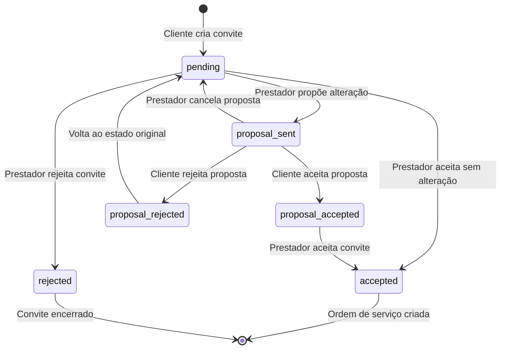

# Design Document

## Overview

Este documento detalha o design da solução para corrigir os problemas lógicos no sistema de propostas de alteração de convites. A solução implementa um fluxo de aprovação robusto que garante consistência financeira e uma experiência de usuário clara para ambas as partes (cliente e prestador).

## Architecture

### Estado do Convite com Propostas

O sistema atual será expandido para incluir estados intermediários que representam o ciclo de vida das propostas:

```
Estados do Convite:
- pending: Convite criado, aguardando resposta do prestador
- proposal_sent: Prestador enviou proposta de alteração
- proposal_accepted: Cliente aceitou a proposta
- proposal_rejected: Cliente rejeitou a proposta  
- accepted: Convite aceito (gera ordem de serviço)
- rejected: Convite rejeitado pelo prestador
```

### Fluxo de Estados



## Components and Interfaces

### 1. Proposal Management Service

**Responsabilidade**: Gerenciar o ciclo de vida das propostas de alteração

```python
class ProposalService:
    def create_proposal(self, invite_id: int, new_value: Decimal, justification: str) -> Proposal
    def approve_proposal(self, proposal_id: int, client_id: int) -> bool
    def reject_proposal(self, proposal_id: int, client_id: int, reason: str) -> bool
    def cancel_proposal(self, proposal_id: int, prestador_id: int) -> bool
    def check_client_balance_sufficiency(self, client_id: int, proposed_value: Decimal) -> BalanceCheck
```

### 2. Balance Validation Component

**Responsabilidade**: Verificar e gerenciar saldo do cliente para propostas

```python
class BalanceValidator:
    def calculate_required_balance(self, proposed_value: Decimal) -> Decimal
    def check_sufficiency(self, client_id: int, required_amount: Decimal) -> BalanceStatus
    def suggest_top_up_amount(self, current_balance: Decimal, required: Decimal) -> Decimal
    def reserve_funds(self, client_id: int, amount: Decimal) -> bool
```

### 3. Notification System Enhancement

**Responsabilidade**: Notificar partes sobre mudanças nas propostas

```python
class ProposalNotificationService:
    def notify_proposal_created(self, invite_id: int, client_id: int, proposal: Proposal)
    def notify_proposal_response(self, invite_id: int, prestador_id: int, status: str)
    def notify_balance_insufficient(self, client_id: int, required_amount: Decimal)
```

### 4. UI State Management

**Responsabilidade**: Controlar estados da interface baseado no status da proposta

```javascript
class InviteUIController {
    updateButtonStates(inviteStatus, userRole, balanceStatus)
    showProposalComparison(originalValue, proposedValue)
    displayBalanceWarning(requiredAmount, currentBalance)
    enableTopUpFlow(minimumAmount)
}
```

## Data Models

### Proposal Model (Nova Tabela)

```sql
CREATE TABLE invite_proposals (
    id INTEGER PRIMARY KEY AUTOINCREMENT,
    invite_id INTEGER NOT NULL,
    prestador_id INTEGER NOT NULL,
    original_value DECIMAL(10,2) NOT NULL,
    proposed_value DECIMAL(10,2) NOT NULL,
    justification TEXT,
    status VARCHAR(20) DEFAULT 'pending', -- pending, accepted, rejected, cancelled
    created_at TIMESTAMP DEFAULT CURRENT_TIMESTAMP,
    responded_at TIMESTAMP NULL,
    client_response_reason TEXT NULL,
    FOREIGN KEY (invite_id) REFERENCES invites(id),
    FOREIGN KEY (prestador_id) REFERENCES users(id)
);
```

### Invite Model Enhancement

```sql
-- Adicionar campos à tabela invites existente
ALTER TABLE invites ADD COLUMN has_active_proposal BOOLEAN DEFAULT FALSE;
ALTER TABLE invites ADD COLUMN current_proposal_id INTEGER NULL;
ALTER TABLE invites ADD COLUMN effective_value DECIMAL(10,2) NULL; -- valor efetivo após proposta aceita

-- Índices para performance
CREATE INDEX idx_invites_proposal_status ON invites(has_active_proposal, status);
CREATE INDEX idx_proposals_invite_status ON invite_proposals(invite_id, status);
```

### Balance Check Model

```python
@dataclass
class BalanceCheck:
    is_sufficient: bool
    current_balance: Decimal
    required_amount: Decimal
    shortfall: Decimal
    suggested_top_up: Decimal
```

## Error Handling

### 1. Validation Errors

**Cenário**: Cliente tenta aceitar proposta sem saldo suficiente
- **Ação**: Bloquear aceitação e exibir opções de adição de saldo
- **UI**: Modal com calculadora de saldo necessário

**Cenário**: Prestador tenta aceitar convite com proposta pendente
- **Ação**: Exibir mensagem explicativa sobre aguardar aprovação
- **UI**: Botão desabilitado com tooltip explicativo

### 2. Concurrency Issues

**Cenário**: Cliente e prestador agem simultaneamente na proposta
- **Solução**: Locks otimistas com timestamps
- **Fallback**: Recarregar estado atual e solicitar nova ação

**Cenário**: Saldo do cliente muda durante processo de aprovação
- **Solução**: Re-validar saldo no momento da confirmação
- **UI**: Atualizar valores em tempo real

### 3. Data Consistency

**Cenário**: Falha na criação da ordem de serviço após aprovação
- **Solução**: Transações atômicas com rollback automático
- **Recovery**: Job de reconciliação para estados inconsistentes

## Testing Strategy

### 1. Unit Tests

**ProposalService Tests**:
- Criação de proposta com valores válidos/inválidos
- Aprovação/rejeição com diferentes cenários de saldo
- Cancelamento de proposta pelo prestador

**BalanceValidator Tests**:
- Cálculo correto de saldo necessário (valor + taxa)
- Verificação de suficiência com diferentes cenários
- Sugestão de valores de recarga

### 2. Integration Tests

**Fluxo Completo de Proposta**:
1. Prestador cria proposta de aumento
2. Cliente recebe notificação
3. Cliente verifica saldo insuficiente
4. Cliente adiciona saldo
5. Cliente aprova proposta
6. Prestador aceita convite
7. Ordem de serviço é gerada com valor correto

**Cenários de Rejeição**:
1. Cliente rejeita proposta
2. Sistema retorna ao estado original
3. Prestador pode aceitar com valor original

### 3. UI/UX Tests

**Estados dos Botões**:
- Verificar desabilitação correta durante proposta pendente
- Validar mensagens explicativas em cada estado
- Testar fluxo de adição de saldo integrado

**Notificações**:
- Verificar clareza das mensagens
- Testar links de ação nas notificações
- Validar atualização em tempo real dos estados

## Implementation Phases

### Phase 1: Database and Core Logic
- Criar tabela de propostas
- Implementar ProposalService básico
- Adicionar validação de saldo

### Phase 2: UI State Management
- Atualizar interfaces para mostrar estados de proposta
- Implementar bloqueio de botões baseado em estado
- Adicionar comparação visual de valores

### Phase 3: Notification System
- Integrar notificações de proposta
- Implementar notificações em tempo real
- Adicionar histórico de propostas

### Phase 4: Balance Integration
- Integrar verificação de saldo na aprovação
- Implementar fluxo de adição de saldo
- Adicionar reserva automática de fundos

## Security Considerations

### 1. Authorization
- Apenas o prestador do convite pode criar propostas
- Apenas o cliente do convite pode aprovar/rejeitar
- Validar ownership em todas as operações

### 2. Input Validation
- Validar valores propostos (não negativos, limites razoáveis)
- Sanitizar justificativas e comentários
- Verificar integridade dos IDs de convite/usuário

### 3. Rate Limiting
- Limitar número de propostas por convite (ex: máximo 3)
- Implementar cooldown entre propostas do mesmo prestador
- Monitorar padrões suspeitos de propostas

## Performance Considerations

### 1. Database Optimization
- Índices apropriados para consultas de proposta
- Paginação para histórico de propostas
- Cache de status de convites ativos

### 2. Real-time Updates
- WebSocket para notificações instantâneas
- Polling eficiente para atualizações de estado
- Debounce em verificações de saldo

### 3. Mobile Performance
- Lazy loading de histórico de propostas
- Compressão de dados de notificação
- Offline handling para ações críticas