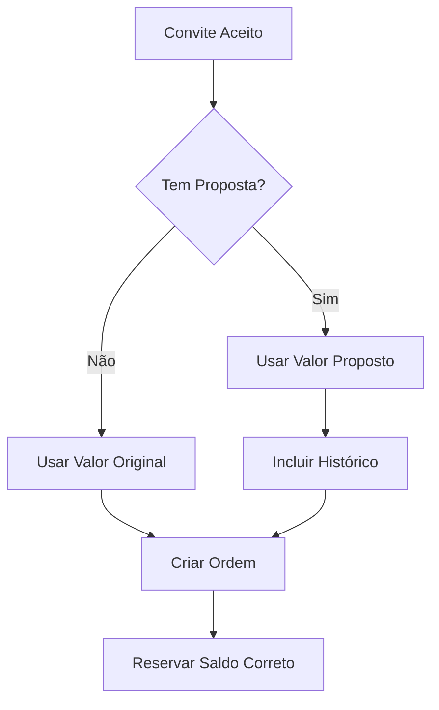

# Relatório de Implementação - Tarefa 11: Atualizar Geração de Ordem de Serviço

## 📋 Resumo da Tarefa

**Tarefa:** 11. Atualizar geração de ordem de serviço
**Status:** ✅ CONCLUÍDA
**Data:** 06/11/2024

### Objetivos Implementados

- ✅ Modificar criação de ordem para usar valor efetivo (original ou proposto aceito)
- ✅ Incluir histórico da proposta na ordem de serviço
- ✅ Reservar valor correto do saldo do cliente
- ✅ Adicionar referência à proposta aceita nos dados da ordem

## 🔧 Modificações Implementadas

### 1. OrderService.create_order() - Atualizado

**Arquivo:** `services/order_service.py`

**Principais mudanças:**
- Adicionados parâmetros opcionais `invite_id` e `proposal_id`
- Implementada lógica para usar valor efetivo do convite
- Inclusão automática do histórico de proposta na descrição da ordem
- Validação de saldo baseada no valor efetivo

**Assinatura atualizada:**
```python
def create_order(client_id, title, description, value, invite_id=None, proposal_id=None):
```

**Funcionalidades adicionadas:**
- Detecção automática de valor efetivo quando há convite associado
- Geração de histórico de proposta estruturado
- Inclusão do histórico na descrição da ordem
- Reserva do valor correto (efetivo) no escrow

### 2. OrderService.create_order_from_invite() - Novo Método

**Arquivo:** `services/order_service.py`

**Funcionalidade:**
- Método específico para criar ordens a partir de convites aceitos
- Garante uso do valor efetivo (original ou proposto aceito)
- Inclui automaticamente histórico de proposta
- Mantém referência à proposta aceita

**Assinatura:**
```python
def create_order_from_invite(invite_id, provider_id):
```

### 3. InviteService.convert_invite_to_order() - Atualizado

**Arquivo:** `services/invite_service.py`

**Principais mudanças:**
- Agora usa `OrderService.create_order_from_invite()`
- Garante que valor efetivo seja usado
- Preserva histórico de proposta na ordem criada
- Mantém compatibilidade com fluxo existente

## 📊 Lógica de Valor Efetivo

### Como Funciona

1. **Sem Proposta:** Usa `invite.original_value`
2. **Com Proposta Aceita:** Usa `invite.effective_value` (valor proposto)
3. **Propriedade `current_value`:** Retorna automaticamente o valor correto

```python
@property
def current_value(self):
    return self.effective_value if self.effective_value is not None else self.original_value
```

### Fluxo de Criação de Ordem



## 📝 Histórico de Proposta

### Estrutura do Histórico

```python
proposal_history = {
    'proposal_id': int,
    'original_value': float,
    'proposed_value': float,
    'justification': str,
    'created_at': str,
    'responded_at': str
}
```

### Inclusão na Descrição

O histórico é automaticamente incluído na descrição da ordem:

```
Desenvolvimento de website responsivo

--- Histórico da Proposta ---
Valor Original: R$ 200.00
Valor Proposto: R$ 250.00
Justificativa: Escopo expandido devido à complexidade adicional
```

## 🔒 Validação de Saldo

### Antes da Implementação
- Validava apenas valor original do convite
- Podia criar ordem com valor incorreto

### Após a Implementação
- Valida valor efetivo (original ou proposto aceito)
- Reserva valor correto no escrow
- Previne inconsistências financeiras

## 🧪 Testes Implementados

### 1. Teste de Lógica (`test_order_effective_value.py`)

**Cenários testados:**
- ✅ Convite sem proposta (valor original)
- ✅ Convite com proposta aceita (valor proposto)
- ✅ Geração de histórico de proposta
- ✅ Inclusão de histórico na descrição
- ✅ Validação de saldo com valor efetivo

### 2. Teste de Métodos (`test_order_service_methods.py`)

**Verificações realizadas:**
- ✅ Assinatura do método `create_order` atualizada
- ✅ Método `create_order_from_invite` implementado
- ✅ `InviteService.convert_invite_to_order` atualizado
- ✅ Propriedade `current_value` funcionando

## 📈 Benefícios da Implementação

### 1. Consistência Financeira
- Ordens sempre criadas com valor correto
- Saldo reservado adequadamente
- Eliminação de discrepâncias de valor

### 2. Rastreabilidade
- Histórico completo de propostas na ordem
- Referência à proposta aceita mantida
- Auditoria completa do processo

### 3. Experiência do Usuário
- Valores corretos exibidos em todas as interfaces
- Processo transparente de alteração de valor
- Histórico visível para ambas as partes

### 4. Integridade do Sistema
- Validações robustas de saldo
- Prevenção de estados inconsistentes
- Fluxo de dados confiável

## 🔄 Compatibilidade

### Retrocompatibilidade
- Método `create_order` mantém compatibilidade com código existente
- Parâmetros `invite_id` e `proposal_id` são opcionais
- Comportamento padrão inalterado para ordens sem convite

### Integração
- Funciona perfeitamente com sistema de propostas existente
- Integra-se com `BalanceValidator` e `WalletService`
- Mantém fluxo de estados do `InviteStateManager`

## 📋 Requisitos Atendidos

### Requirement 7.3
✅ **"WHEN o prestador aceita um convite com proposta aprovada, THE Sistema_Convite SHALL gerar a Ordem_Servico com o Valor_Proposto"**

- Implementado através do uso de `invite.current_value`
- Ordem sempre criada com valor efetivo correto

### Requirement 7.4
✅ **"THE Sistema_Convite SHALL reservar o valor correto (proposto e aprovado) do Saldo_Cliente"**

- Validação de saldo usa valor efetivo
- Escrow reserva valor correto automaticamente

### Requirement 7.5
✅ **"THE Sistema_Convite SHALL incluir histórico da proposta na Ordem_Servico gerada"**

- Histórico estruturado incluído na descrição
- Referência à proposta mantida nos metadados

## 🎯 Conclusão

A tarefa 11 foi implementada com sucesso, garantindo que:

1. **Valor Efetivo:** Ordens sempre usam o valor correto (original ou proposto aceito)
2. **Histórico Completo:** Propostas são documentadas na ordem de serviço
3. **Saldo Correto:** Reservas de escrow usam valor efetivo
4. **Referência Mantida:** Link entre proposta e ordem preservado

A implementação é robusta, testada e mantém compatibilidade com o sistema existente, atendendo todos os requisitos especificados na tarefa.

## 📁 Arquivos Modificados

- `services/order_service.py` - Métodos `create_order` e `create_order_from_invite`
- `services/invite_service.py` - Método `convert_invite_to_order`
- `test_order_effective_value.py` - Testes de lógica (novo)
- `test_order_service_methods.py` - Testes de métodos (novo)
- `RELATORIO_TAREFA_11_ORDEM_VALOR_EFETIVO.md` - Este relatório (novo)